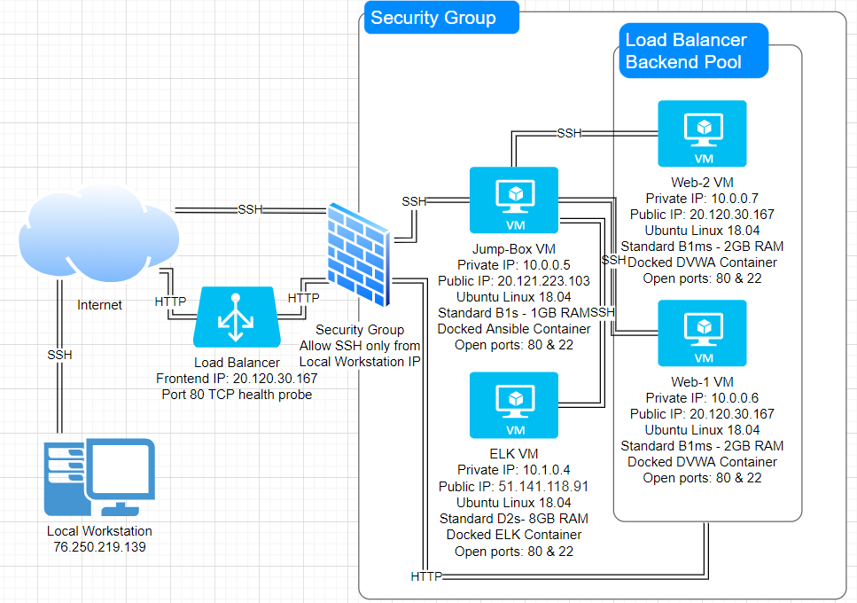
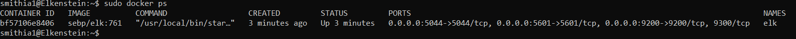

## Automated ELK Stack Deployment

The files in this repository were used to configure the network depicted below.

These files have been tested and used to generate a live ELK deployment on Azure. They can be used to either recreate the entire deployment pictured above. Alternatively, select portions of the _____ file may be used to install only certain pieces of it, such as Filebeat.

  - _TODO: Enter the playbook file._

This document contains the following details:
- Description of the Topology
- Access Policies
- ELK Configuration
  - Beats in Use
  - Machines Being Monitored
- How to Use the Ansible Build

### Description of the Topology

The main purpose of this network is to expose a load-balanced and monitored instance of DVWA, the D*mn Vulnerable Web Application.

Load balancing ensures that the application will be highly reliable, in addition to restricting access to the network.

Integrating an ELK server allows users to easily monitor the vulnerable VMs for changes to the logs and system metrics.

The configuration details of each machine may be found below.

| Name     | Function   | IP Address | Operating System |
| -------- | ---------- | ---------- | ---------------- |
| Jump-Box | Gateway    | 10.0.0.5   | Linux            |
| Web-1    | Web server | 10.0.0.6   | Linux            |
| Web-2    | Web server | 10.0.0.7   | Linux            |
| ELK      | Kibana VM  | 10.1.0.4   | Linux            |

### Access Policies

The machines on the internal network are not exposed to the public Internet. 

Only the Jump Box machine can accept connections from the Internet. Access to this machine is only allowed from the following IP addresses: 76.250.219.139

Machines within the network can only be accessed by 10.0.0.5 (Jump Box)

A summary of the access policies in place can be found in the table below.

| Name        | Publicly Accessible | Allowed IP Addresses |
| ----------- | ------------------- | -------------------- |
| Jump Box    | Yes (SSH)           | 76.250.219.139       |
| Web-1 and 2 | Yes (HTTP)          | Any                  |
| ELK         | No                  | 10.0.0.5             |

### Elk Configuration

Ansible was used to automate configuration of the ELK machine. No configuration was performed manually, which is advantageous because it is easily repeatable with no errors.

The playbook implements the following tasks:
- Increase the memory of the VM
- Download docker.io
- Install python3-pip
- Install python docker
- Enable the docker service
- Download ELK container image, and enable it on restart

The following screenshot displays the result of running `docker ps` after successfully configuring the ELK instance.

### Target Machines & Beats
This ELK server is configured to monitor the following machines:
- 10.0.0.6
- 10.0.0.7

We have installed the following Beats on these machines:
- Filebeat
- Metricbeat

These Beats allow us to collect the following information from each machine:

- Filebeat collects system logs for monitoring and analysis in order to more easily diagnose and fix problems.
- Metricbeat allows admins to monitor system-level usage such as CPU, system memory, and network I/O statistics.

### Using the Playbook
In order to use the playbook, you will need to have an Ansible control node already configured. Assuming you have such a control node provisioned: 

SSH into the control node and follow the steps below:
- Copy the filebeat-playbook.yml and metricbeat-playbook.yml files to /etc/ansible/roles.
- Update the /etc/ansible/hosts file to include [elk] 10.1.0.4 ansible_python_interpreter=/usr/bin/python3
- Run the playbook, and navigate to '<elk.VM.IP.address>:5601/app/kibana#/home' to check that the installation worked as expected.
